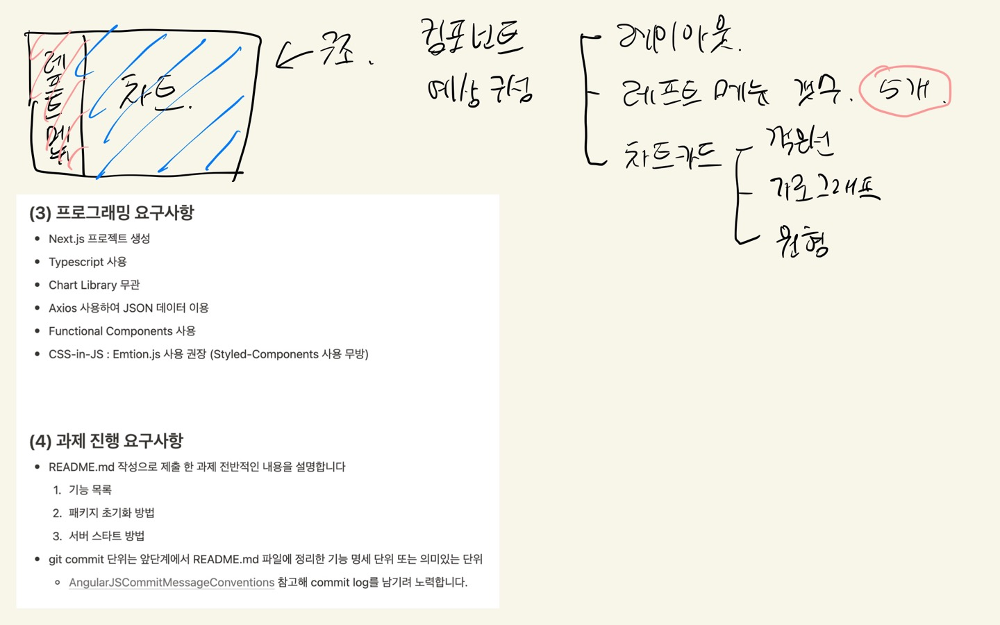

# DBDLAB - CHART

안녕하세요. 프론트엔드 개발자 포지션에 지원한 정세현입니다.
<br>
이번 과제를 통해 새로운 것을 접해보는 시간을 가지게 되었습니다. 진행을 하면서, [React로 사고하기](https://ko.reactjs.org/docs/thinking-in-react.html)를 생각하며 설계 시작 후 진행하였습니다.
<br>

<details>
<summary>과제를 받고</summary>
<div markdown="1">



</div>
</details>

진행하면서 렌더링 최적화를 위해서 import 시, 필요한 것만 {} 묶어 import하였고, 전역으로 상태관리를 사용하지 않고 props를 내려 사용하였습니다.
<br>
과제를 완료하지 못하였지만, 많이 배우는 시간이 되었습니다. 감사합니다.

<br>

## 📝 기능구현 리스트

- ✅ 사이드 바 메뉴 클릭
  - [x] 선택 된 Menu item color 변경이 가능합니다.
  - [x] 해당하는 페이지로 push 후 메인 섹션은 빈페이지로 라우팅(path는 임의 설정)됩니다.
- ❌ 차트구현 (진행중)
  - [x] 코로나 일자 별 코로나 확진자 수 : **Line Chart**
  - [ ] 코로나 일자 별 연령대 확진자 수 : **Stacked Bar Chart**
  - [ ] 코로나 일자 별 성별 확진자 수 : **Pie Chart**
- ✅ 주어진 Data를 사용하여 JSON URL로 이용합니다.
  - [x] JSON 파일 접속 후 URL 사용
  - [x] 코로나 19 감염 현황
  - [x] 코로나 19 연령별, 성별 감염 현황

<br>

## ⚙️ 사용방법

```
  1. git clone https://github.com/rnfltpgus/dbdlab_chart.git
  2. cd dbdlab_chart
  3. npm install or npm i
  4. npm run dev
```

<br>

## 🚀 진행하며 참고한 링크

- https://nextjs.org/docs/api-reference/next/link
- https://nextjs.org/docs/api-reference/next/router
- https://nextjs.org/docs/api-reference/next.config.js/redirects
- https://nextjs.org/docs/api-reference/data-fetching/get-server-side-props
- https://nextjs.org/docs/messages/gssp-component-member
- https://www.chartjs.org/docs/latest/samples/line/line.html
- https://react-chartjs-2.js.org/examples/line-chart
